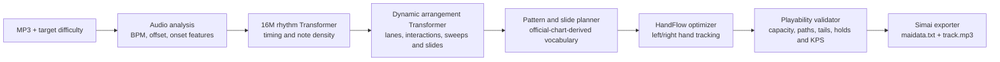

# ORBIT-8

**Neural maimai chart engine by SeaLandX.**

ORBIT-8 converts an MP3 and a target difficulty into a FiNALE-compatible chart
folder containing `maidata.txt` and `track.mp3`. It estimates BPM and offset,
extracts an audio-aligned rhythm plan, arranges playable maimai patterns, and
checks the result against two-hand movement constraints before export.

> ORBIT-8 is a research prototype. Generated charts should be reviewed and
> play-tested in an editor before publication.

## Architecture



ORBIT-8 deliberately separates **rhythm transcription** from **chart
arrangement**. The rhythm model decides *when* notes should occur by combining
audio features with the requested difficulty. The arrangement model decides
*how* those notes should be expressed on the eight-button ring, learning lane
movement and pattern vocabulary from level 12-15 official charts.

The neural output then passes through a deterministic playability layer:

- **HandFlow beam search** tracks both hands, their current lanes, travel speed,
  crossed posture, and active hold or slide reservations.
- **Pattern-aware constraints** preserve intentional interactions and regular
  sweeps while repairing irregular 16th-note hand changes and excessive jacks.
- **Long-object safety** treats holds, slides, and Wi-Fi slides as occupied hands
  and protects slide paths and tails from taps, collisions, and impossible chords.
- **Difficulty calibration** controls density, interaction, sweep, and jack heat
  before producing a chart that can be inspected in a maimai editor.

## Model Line

| Model | Rhythm planning | Arrangement | Playability |
| --- | --- | --- | --- |
| ORBIT-8 v1.7.1 | consensus onset pipeline | official-pattern arranger | rule validation |
| Trans-02 | rhythm Transformer | Trans-1 Transformer | rule validation |
| ORBIT-8 v2.1 HandFlow | calibrated 16M Transformer | dynamic Trans-1 Transformer | strict two-hand HandFlow |

The current experimental mainline is **ORBIT-8 v2.1 HandFlow**. Its dynamic
arranger is trained with 8/12/16-measure chart crops and horizontal, vertical,
and half-turn augmentation. The released arranger contains about 3M parameters;
the rhythm model uses the expanded 16M architecture.

## Pipeline

1. Analyze audio and estimate BPM, offset, and onset features.
2. Generate a difficulty-conditioned rhythm plan aligned to the music.
3. Predict lanes and maimai pattern operators with the arrangement Transformer.
4. Construct taps, holds, interactions, sweeps, and legal slide templates.
5. Optimize left/right hand assignments and repair unreasonable movement.
6. Validate hand capacity, long-object conflicts, slide paths, tails, and density.
7. Export a song folder containing `track.mp3`, `maidata.txt`, and a generation report.

Generated charts use `SeaLandX feat. ORBIT-8` as the default designer credit.

## Run

```powershell
powershell -ExecutionPolicy Bypass -File .\start_maimai_web.ps1
```

Open <http://127.0.0.1:8765/> and import an MP3. The web interface supports model
selection and controls for difficulty, interaction, sweep, and jack intensity.

## Training Data Notice

Training datasets, official chart archives, copyrighted audio, generated songs,
virtual environments, and large checkpoints are not intended to be committed to
this source repository. Publish only data and model files for which you have the
necessary distribution rights.
