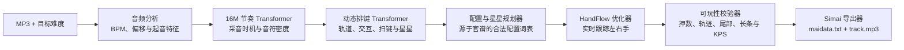

# ORBIT-8

[English](README.md) | [简体中文](README.zh-CN.md)

> [!IMPORTANT]
> **仓库的源码压缩包不包含模型权重。**如需运行模型，请前往
> [GitHub Releases](https://github.com/CaptainLand/ORBIT-8/releases) 下载完整的
> `ORBIT-8-v2.1.0-preview-windows.zip`。训练数据不会随项目分发。

**SeaLandX 开发的 maimai 神经网络谱面生成引擎。**

ORBIT-8 可根据 MP3 音频和目标难度生成兼容 FiNALE 的谱面文件夹，其中包含
`maidata.txt` 与 `track.mp3`。系统会自动估计 BPM 和偏移值，提取与音频对齐的
节奏计划，编排可游玩的 maimai 配置，并在导出前根据双手运动约束检查谱面。

> ORBIT-8 目前是研究原型。生成谱面在发布前仍应使用编辑器检查并进行实机试玩。

## 系统架构



ORBIT-8 将**节奏采音**与**谱面排键**拆分处理。节奏模型结合音频特征与目标难度，
决定音符应该在“什么时候”出现；排键模型则决定这些音符应该“如何”分布在八个键位上，
并从 12 至 15 级官谱中学习键位移动和配置语汇。

神经网络输出随后会经过确定性的可玩性处理层：

- **HandFlow 束搜索**持续跟踪双手所在键位、移动速度、交叉姿态，以及正在占用手部的
  长条和星星。
- **配置感知约束**保留有意设计的交互与规则扫键，同时修复不规律的 16 分换手和过量纵连。
- **长物件安全检查**将 Hold、Slide 和 Wi-Fi 星星计入手部占用，并防止 Tap 进入星星轨迹、
  撞尾或形成无法完成的多押。
- **难度校准**在输出编辑器可检查的谱面前，控制密度、交互、扫键和纵连热度。

## 模型代际

| 模型 | 节奏采音 | 排键 | 可玩性处理 |
| --- | --- | --- | --- |
| ORBIT-8 v1.7.1 | 共识起音流程 | 官谱配置排键器 | 规则校验 |
| Trans-02 | 节奏 Transformer | Trans-1 Transformer | 规则校验 |
| ORBIT-8 v2.1 HandFlow | 校准后的 16M Transformer | 动态 Trans-1 Transformer | 严格双手 HandFlow |

当前实验主线为 **ORBIT-8 v2.1 HandFlow**。动态排键模型使用 8、12、16 小节的谱面切片，
并通过左右镜像、上下镜像与全反进行数据增强。发布版排键模型约有 300 万参数，节奏模型则
使用扩展后的 1600 万参数架构。

## 生成流程

1. 分析音频，估计 BPM、偏移值和起音特征。
2. 生成与音乐对齐、受目标难度控制的节奏计划。
3. 使用排键 Transformer 预测键位与 maimai 配置操作符。
4. 构建 Tap、Hold、交互、扫键和合法星星模板。
5. 优化左右手分配并修复不合理手顺。
6. 校验手部押数、长物件冲突、星星轨迹、撞尾与谱面密度。
7. 导出包含 `track.mp3`、`maidata.txt` 和生成报告的歌曲文件夹。

生成谱面的默认谱师署名为 `SeaLandX feat. ORBIT-8`。

## 下载与运行

v2.1 预览版目前需要 Windows、Python 3.12，以及驱动支持 CUDA 12.8 的 NVIDIA 显卡。

1. 前往 [Releases](https://github.com/CaptainLand/ORBIT-8/releases) 下载并解压
   `ORBIT-8-v2.1.0-preview-windows.zip`。
2. 在解压目录打开 PowerShell，安装运行环境：

```powershell
.\setup_orbit8.ps1
```

3. 启动本地网页：

```powershell
.\start_maimai_web.ps1
```

打开 <http://127.0.0.1:8765/> 并导入 MP3。网页端支持选择模型，并可调节难度、
交互、扫键和纵连强度。

## 训练数据说明

训练集、官谱压缩包、受版权保护的音频、生成歌曲、虚拟环境和训练过程中的中间权重均不
对外分发。发行包只包含运行 ORBIT-8 v2.1 所需的推理权重与精简运行时元数据。
